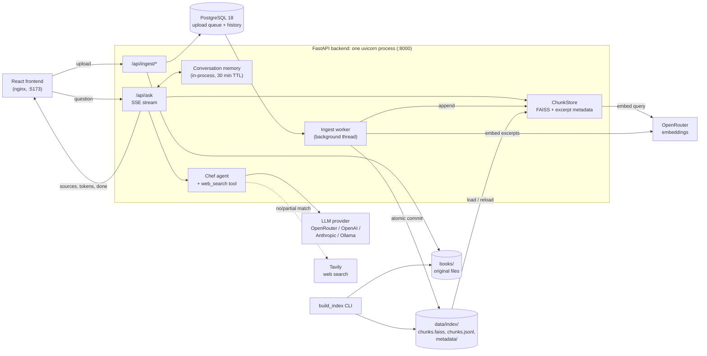

# Chef Library 🍳

Chef Library lets you search a personal collection of nearly 750 gastronomy
books by asking questions, the way you would ask a research chef. Ask about an
ingredient, a technique, or the origin of a dish, in Portuguese or English. The
answer cites the book behind every claim. When the books have nothing on the
topic, the chef says so, then answers from general knowledge or the web and
labels that part as coming from outside the collection.

Under the hood it is a retrieval-augmented generation (RAG) app: a FastAPI
backend runs hybrid search (semantic plus rare-keyword) over about 100,000
book excerpts and streams a cited answer from an LLM to a React frontend. The
collection keeps growing: new books uploaded in the app are cleaned,
classified, deduplicated and become searchable without a restart.

## Built with

- **[Claude](https://claude.com)** (Anthropic): answers the questions, and also wrote the project's code.
- **[Impeccable](https://impeccable.style)**: the design skill used to design the interface.
- FastAPI · FAISS · PostgreSQL 18 · React 19 + Vite · Tesseract (OCR) · Docker Compose.

## Quick start

You need [Docker](https://www.docker.com/) and an
[OpenRouter](https://openrouter.ai/keys) API key.

1. Copy `.env.example` to `.env` and paste your key into `OPENROUTER_API_KEY`.
2. Download the prebuilt index from
   [Google Drive](https://drive.google.com/drive/folders/1eVC778JCQRmXJA8lawSlQdZlZOwFqqan?usp=sharing)
   and put it at the repository root as `data/`, so that `data/index/` exists.
3. Start everything:

   ```bash
   docker compose up --build
   ```

4. Open **http://localhost:5173**.

This starts the frontend, the backend and Postgres, and reuses the index in
`data/`, so nothing needs to be rebuilt. The first question may take 15–30 s
while the backend finishes loading the index (about 600 MB) into memory.

## Configuration

All settings live in `.env`; [.env.example](.env.example) documents each one.

| Variable | Needed for | Notes |
| --- | --- | --- |
| `OPENROUTER_API_KEY` | Search and adding books | **Required.** Embeddings for questions and excerpts always go through OpenRouter (`EMBED_MODEL`, default `openai/text-embedding-3-small`). |
| `OPENROUTER_MODEL` | Answers | Model that writes the answer. |
| `OPENAI_API_KEY`, `ANTHROPIC_API_KEY`, `OLLAMA_BASE_URL` | Answers (alternatives) | The answering model is picked by priority: OpenRouter > OpenAI > Anthropic > local Ollama. Embeddings still need OpenRouter. |
| `TAVILY_API_KEY` | Web fallback | Optional. Without it the chef can't search the web and answers off-collection questions from the model's own knowledge. |
| `OCR_WORKERS` | OCR | Tesseract processes run in parallel (default 2). |

## Adding books

Open the **Add books** tab and drop in files or whole folders. Accepted
formats: PDF, EPUB, DOCX, ODT, RTF, HTML, TXT and Markdown, with no size limit.
Each book goes through the same cleaning and classification as the rest of the
collection. It becomes searchable once it shows **Added**, with no restart.
Uploads can be cancelled, and processing continues if you leave the tab.

- Files that aren't cooking books, that are already in the collection (even
  in another format), or that are password/DRM-protected are not added; the
  tab says why for each one.
- Scanned PDFs (images with no selectable text) stop at **No extractable
  text** and offer **Try with OCR**. OCR is slow (minutes to tens of minutes
  per book), and its quality depends on the scan.
- OCR runs `OCR_WORKERS` Tesseract processes at once. Each one uses hundreds
  of MB, and with Docker Desktop's default memory limit, running more of them
  got the backend killed.

### Removing a book

Books can't be removed or renamed from the tab. Use the maintenance command
with the backend stopped:

```bash
docker compose stop backend
docker compose run --rm backend python -m backend.ingest.remove_books --title "Exact Title" --dry-run
docker compose run --rm backend python -m backend.ingest.remove_books --title "Exact Title"
docker compose start backend
```

Also delete the book's original from `books/`, or a later `--rebuild` brings it back.

## Rebuilding the index

```bash
docker compose exec backend python -m backend.ingest.build_index
```

This processes any new file in `books/` and then regenerates every embedding.

| Flag | Effect |
| --- | --- |
| `--no-llm` | Book metadata from heuristics only (free, no LLM calls) |
| `--skip-embed` | Run only phase 1 (cleaning + metadata) |
| `--ocr` | OCR scanned PDFs (slow) |
| `--limit N` | Process only the first N books (testing) |
| `--rebuild` | Ignore the cache and reprocess everything from scratch |
| `--force` | Allow `--rebuild` even when `books/` looks incomplete |

> [!WARNING]
> `--rebuild` only knows about the originals in `books/`. The downloaded index
> ships **without** its originals, so a rebuild would wipe it. The command
> refuses to run while `books/` holds fewer than 90% of the indexed books. Put
> the originals in `books/` first, or pass `--force` only if you mean it.

## Architecture



### Answering a question

1. **Rewrite.** If the conversation has history, a short LLM call turns a
   follow-up ("and the chocolate version?") into a standalone query
   ([agent/chef.py](backend/agent/chef.py)). The last 6 exchanges per
   conversation live only in memory ([agent/memory.py](backend/agent/memory.py))
   and are never written to disk.
2. **Hybrid search.** The query is embedded and matched against the FAISS
   index by cosine similarity. Query words that appear in fewer than 1% of
   excerpts (such as "entremet" or "tempura") also get a lexical ranking,
   merged with the semantic one by reciprocal rank fusion, so specific terms
   aren't drowned out by generic ones. Filters (kind, ingredient, book,
   region, dish type) apply to an oversampled candidate pool
   ([search/store.py](backend/search/store.py)).
3. **Answer.** The excerpts, conversation history and system prompt
   ([prompts/chef_system.md](backend/prompts/chef_system.md)) go to the first
   configured provider ([core/providers.py](backend/core/providers.py)). With
   `TAVILY_API_KEY` set, the model gets a `web_search` tool and decides when
   to use it. Web results continue the excerpt numbering, so every `[n]`
   citation points to either a book or a URL.
4. **Stream.** The browser receives Server-Sent Events: `sources` (or
   `fallback` when nothing matched), `searching`, `web_sources`, `token`,
   then `done` or `error`.

### Adding a book

Uploads are stored in `data/ingest/` and queued as jobs in Postgres
([ingest/jobs.py](backend/ingest/jobs.py)); a byte-identical file is flagged
as a duplicate right away. One worker thread inside the API process
([ingest/worker.py](backend/ingest/worker.py)) handles one book at a time
through these stages:

```
extracting → (ocr) → cleaning → chunking → embedding → checking_duplicates → metadata → indexing
```

- **Extract** per format ([ingest/extract/](backend/ingest/extract/)); the
  extracted text is cached by file hash, so rebuilds never redo OCR.
- **Clean and classify** ([clean.py](backend/ingest/clean.py),
  [classify.py](backend/ingest/classify.py)): rebuild paragraphs, drop
  unreadable OCR, and reject non-culinary books and reference tomes.
- **Chunk** ([chunk.py](backend/ingest/chunk.py)): one excerpt per recipe when
  the book has recipe structure, otherwise one per section or paragraph window.
- **Deduplicate** ([dedup.py](backend/ingest/dedup.py)): nearest-neighbour
  embeddings propose candidate books, and shared 5-word sequences confirm them.
  This catches the same work in a different file format.
- **Metadata** ([metadata.py](backend/ingest/metadata.py)): heuristics plus
  one cheap LLM call per book give its region, dish types and tags.
- **Commit** ([commit.py](backend/ingest/commit.py)): the FAISS index and
  excerpt list must change together, so the commit writes temp files, then a
  journal, then swaps the files in. A crash at any point is recovered on the
  next startup. A file lock keeps the worker and the CLI from writing at the
  same time.

The `build_index` CLI shares the same pipeline
([ingest/pipeline.py](backend/ingest/pipeline.py)) in two phases: a resumable
per-book phase that caches LLM results, then an idempotent phase that
re-embeds everything. When the CLI rewrites the index, the running API notices
the change to `manifest.json` and reloads it.

### Where things live

| Path | Contents | Persisted |
| --- | --- | --- |
| `books/` | Original files, including uploads | Host folder |
| `books_md/` | Cleaned text per book | Host folder |
| `data/index/` | `chunks.faiss`, `chunks.jsonl`, per-book metadata, manifest | Host folder |
| `data/ingest/` | Uploads in progress and extracted-text cache | Host folder |
| `pgdata` volume | Upload queue and history (Postgres) | Docker volume |

All of these survive restarts and image rebuilds. Don't edit `data/index/`
from the host while the backend is running. Work inside the container
(`docker compose exec backend ...`) or stop the backend first. To inspect the
queue, run `docker compose exec db psql -U chef chef_library`. An older
`data/ingest/jobs.sqlite3` history is migrated to Postgres on startup and kept
as `jobs.sqlite3.migrated`.

### Design constraints

- **Single backend process.** The ingest worker is a thread inside the API,
  and the index is held in memory, so the API must run as one uvicorn process.
- **Memory.** The loaded index takes over 2 GB of RAM. On reload, the old
  copy is released before the new one loads, because holding both got the
  container killed.
- **Embeddings are remote.** Local sentence-transformers took about 4 hours
  for the full collection on a low-RAM Mac. The OpenRouter API does it in
  about 20 minutes for under US$1, which is why an OpenRouter key is required
  even with a local answering model.

## Development

```bash
pip install -r requirements.txt
docker compose up -d db          # Postgres on localhost:5432, used by the app and by the tests
pytest tests/                    # each test runs in its own throwaway schema
uvicorn backend.api.main:app --reload --port 8000   # single process: the upload queue runs inside it
cd frontend && npm install && npm run dev
```

The frontend calls the backend at `VITE_API_URL` (default
`http://localhost:8000`; see [frontend/.env.example](frontend/.env.example)).
OCR outside Docker needs Tesseract (`brew install tesseract tesseract-lang` on
macOS). When you run the backend outside Docker with Ollama, set
`OLLAMA_BASE_URL=http://localhost:11434/v1`.

Tests are split into [tests/unit/](tests/unit/) (agent, search, dedup,
extraction, job state machine) and [tests/integration/](tests/integration/)
(API, CLI, cancellation, commit recovery, persistence).

## License

[GPL-3.0](LICENSE). The books themselves are not part of this repository.
